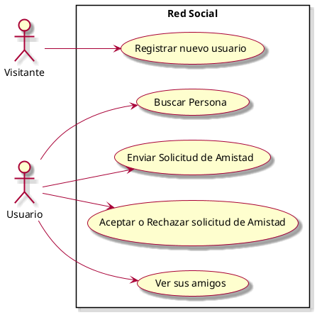
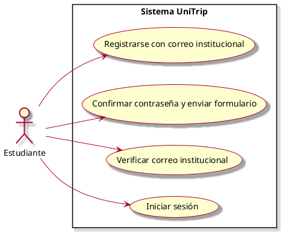

# Casos de Uso

## Diagrama de Casos de Uso (Registrar nuevo usuario)

## Caso de Uso: Registrarse con correo institucional

## Listado de Casos de Uso

| # | Nombre |
|---|--------|
| CU01  | [Registrar nuevo usuario](casos-de-uso/CU01-Registrar-nuevo-usuario.md) |
| CU02  | [Registrar usuario con correo institucioanl](casos-de-uso/CU01-Registrar-nuevo-usuario.md) |
| CU03  | Enviar Solicitud de Amistad |
| CU04  | Aceptar o Rechazar solicitud de Amistad |
| CU05  | Ver sus amigos |